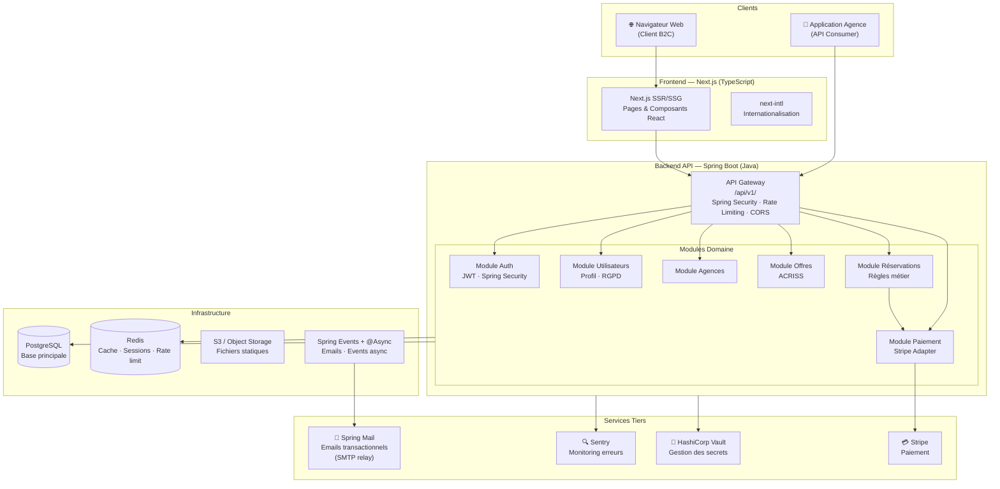
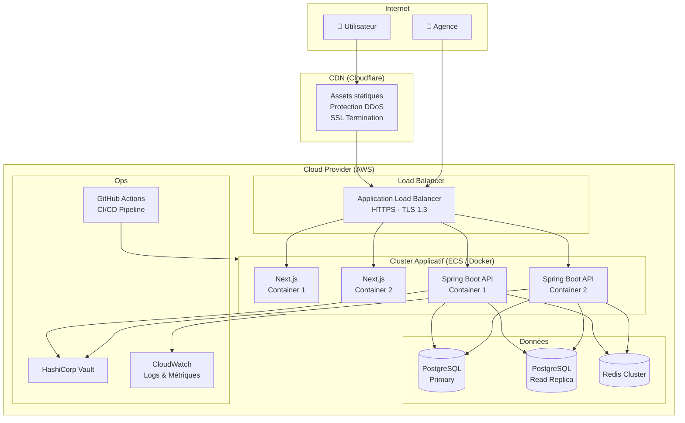
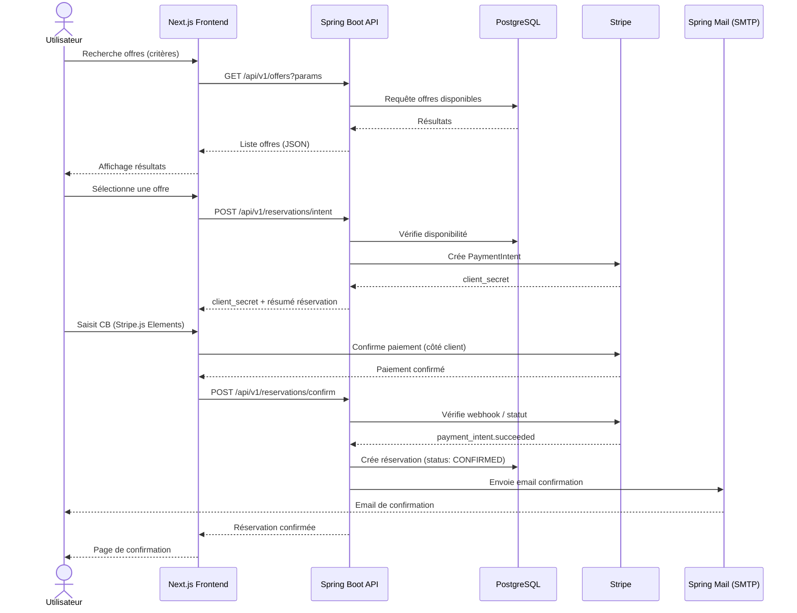
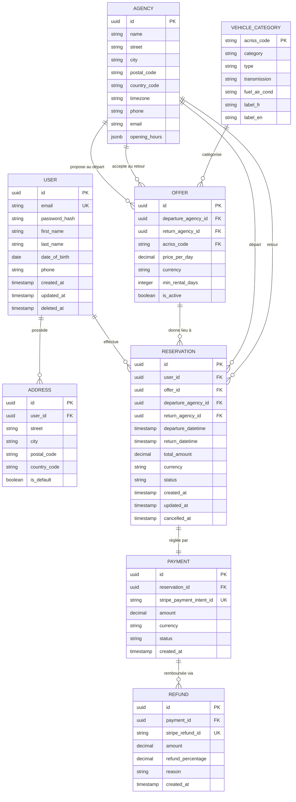
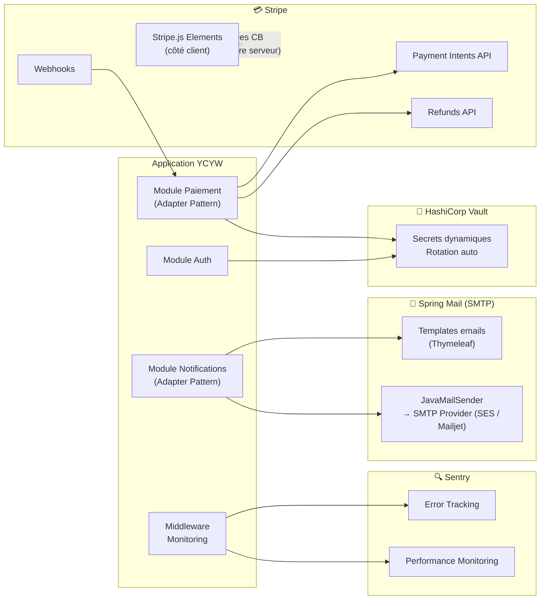

# Proposition d'Architecture — Your Car Your Way

| Champ | Valeur                                                  |
|---|---------------------------------------------------------|
| Version | 1.0                                                     |
| Auteur | Bastien Esquiros - Lead Développeur — Your Car Your Way |
| Date | Mai 2026                                                |

---

## Sommaire

1. [Audit de l'existant](#1-audit-de-lexistant)
2. [Spécifications techniques](#2-spécifications-techniques)
3. [Architecture applicative](#3-architecture-applicative)
4. [Modèle de données](#4-modèle-de-données)
5. [Choix technologiques argumentés](#5-choix-technologiques-argumentés)
6. [Intégration des composants tiers](#6-intégration-des-composants-tiers)
7. [Bonnes pratiques transverses](#7-bonnes-pratiques-transverses)

---

## 1. Audit de l'existant

### 1.1 Objectif de l'audit

Cet audit évalue objectivement l'état des applications web existantes de Your Car Your Way, afin d'identifier les actifs réutilisables, les dettes techniques à traiter et les contraintes à intégrer dans la conception de la nouvelle solution centralisée.

> ⚠️ L'audit décrit l'existant tel qu'il est — il ne propose pas encore de solution. Les recommandations sont développées dans les sections suivantes.

### 1.2 Critères d'évaluation

| Critère | Définition |
|---|---|
| **Maintenabilité** | Capacité à corriger, faire évoluer et comprendre le code sans effort disproportionné. Inclut la lisibilité, la modularité, la couverture de tests et la gestion des dépendances. |
| **Performance** | Capacité à répondre aux requêtes dans des délais acceptables, y compris en charge élevée (pics saisonniers). Mesurée par le débit (req/s), le taux d'erreur et les temps de réponse. |
| **Évolutivité (Scalabilité)** | Capacité à faire croître le système horizontalement ou verticalement pour absorber une augmentation de la charge ou l'ajout de nouvelles fonctionnalités sans refonte majeure. |
| **Sécurité** | Niveau de protection des données utilisateurs (authentification, chiffrement, gestion des secrets, surface d'attaque via les dépendances). |
| **Fiabilité** | Capacité à rester disponible, à récupérer rapidement après un incident, et à garantir l'intégrité des données (MTTR, taux de disponibilité, backups). |
| **Interopérabilité** | Capacité des applications à échanger des données entre elles, à exposer des APIs cohérentes et à s'intégrer avec des composants tiers. |

### 1.3 Cartographie de l'existant

```
┌─────────────────────────────────────────────────────────────────────┐
│                     YOUR CAR YOUR WAY — EXISTANT                    │
│                                                                     │
│  ┌─────────────────────────────────┐   ┌──────────────────────────┐ │
│  │      CLUSTER OVH (Europe)       │   │    CLUSTER AWS/AZURE     │ │
│  │                                 │   │                          │ │
│  │  ┌────────┐  ┌────────────────┐ │   │  ┌──────┐  ┌─────────┐  │ │
│  │  │   FR   │  │  DE / ES / IT  │ │   │  │  UK  │  │   CA    │  │ │
│  │  │Java EE │  │    Java EE     │ │   │  │ PHP  │  │Node.js  │  │ │
│  │  │JSP/JSF │  │   JSP/JSF      │ │   │  │Laravel│  │React   │  │ │
│  │  │ BDD FR │  │  BDD DE/ES/IT  │ │   │  │BDD UK│  │BDD CA  │  │ │
│  │  └────────┘  └────────────────┘ │   │  └──────┘  └─────────┘  │ │
│  │                                 │   │                          │ │
│  │         Déploiements manuels    │   │  ┌─────────────────────┐ │ │
│  └─────────────────────────────────┘   │  │          US         │ │ │
│                                        │  │  Spring Boot        │ │ │
│                                        │  │  Angular / Azure    │ │ │
│                                        │  │  BDD US (non redond)│ │ │
│                                        │  └─────────────────────┘ │ │
│                                        └──────────────────────────┘ │
│                                                                     │
│  ← Aucune API commune ─ Aucun schéma partagé ─ Aucun SSO →         │
└─────────────────────────────────────────────────────────────────────┘
```

| Pays | Frontend | Backend | Hébergement | BDD | Déploiement |
|---|---|---|---|---|---|
| France | JSP/JSF | Java EE | OVH | Propre | Manuel |
| Allemagne | JSP/JSF | Java EE | OVH | Propre | Manuel |
| Espagne | JSP/JSF | Java EE | OVH | Propre | Manuel |
| Italie | JSP/JSF | Java EE | OVH | Propre | Manuel |
| Royaume-Uni | PHP/Laravel | PHP/Laravel | AWS EC2 | Propre | Partiellement auto |
| Canada | React | Node.js | AWS | Propre | Partiellement auto |
| États-Unis | Angular | Spring Boot | Azure (containers) | Propre | CI/CD partiel |

**Observation :** 6 stacks techniques distinctes, 6 bases de données indépendantes, 0 API commune.

### 1.4 Analyse par critère

#### Maintenabilité

Les applications DE/ES/IT sont des forks du code FR, engendrant une divergence progressive : corrections de bugs et évolutions à appliquer manuellement sur chaque branche.

| Application | % dépendances vulnérables |
|---|---|
| France | **41 %** 🔴 |
| Allemagne / Espagne / Italie | **35–38 %** 🔴 |
| Canada | 22 % 🟡 |
| Royaume-Uni | 18 % 🟡 |
| États-Unis | **11 %** 🟢 |

Délai de stabilisation post-release : **3,4 jours** sur OVH vs 1,7 jour sur cloud. **Verdict : ❌ Non satisfaisant sur OVH.**

#### Performance

Les applications OVH plafonnent à **~150 req/s** (vs 350 req/s pour l'app US). Taux d'erreur en pic saisonnier : jusqu'à **4 %** sur OVH (1 transaction sur 25 en échec) vs 0,8 % sur US. **Verdict : ❌ Insuffisant sur OVH.**

#### Évolutivité

| Cluster | Scalabilité horizontale | Conteneurisation | CI/CD | Taux succès déploiement |
|---|---|---|---|---|
| OVH (FR/DE/ES/IT) | ❌ Aucune | ❌ Non | ❌ Manuel | **82 %** 🔴 |
| AWS (UK/CA) | ⚠️ Partielle | ❌ Non | ⚠️ Partielle | 91 % 🟡 |
| Azure (US) | ✅ Oui | ✅ Oui | ⚠️ Partielle | 91 % 🟡 |

**Verdict : ❌ Critique sur OVH. ✅ Acceptable uniquement pour US.**

#### Sécurité

| Application | Hashage MDP | TLS | Secrets |
|---|---|---|---|
| FR/DE/ES/IT | **SHA-1** 🔴 obsolète | TLS 1.0 🔴 | Fichiers config en clair 🔴 |
| UK | bcrypt (cost 10) 🟢 | TLS 1.2+ 🟢 | Env vars AWS 🟡 |
| CA | argon2id 🟢 | TLS 1.2+ 🟢 | Env vars AWS 🟡 |
| US | bcrypt (strength 12) 🟢 | TLS 1.2+ 🟢 | Azure KeyVault (partiel) 🟢 |

**Verdict : 🔴 Critique sur FR/DE/ES/IT. Satisfaisant uniquement sur US.**

#### Fiabilité

| Application | Disponibilité | MTTR | Indisponibilité mensuelle | Backup testé |
|---|---|---|---|---|
| FR/DE/ES/IT | 97,2 % 🔴 | ~2h45 | 21–28 min | ❌ Jamais |
| UK / CA | 98,6 / 98,1 % 🟡 | ~1h10 | 9–16 min | ❌ Irrégulier |
| US | **98,9 %** 🟢 | ~1h10 | 7 min | ✅ Tous les 90j |

Cible SLA : 99,9 % — aucune application ne l'atteint. **Verdict : 🔴 Insuffisant partout.**

#### Interopérabilité

Aucune API commune, schémas de données divergents par pays, partage d'information inexistant ou manuel. **Verdict : 🔴 Blocage fondamental à l'internationalisation.**

### 1.5 Synthèse Forces / Faiblesses / Contraintes

**Forces (actifs à capitaliser)**

| Force | Localisation | Intérêt |
|---|---|---|
| Conteneurisation | US (Azure) | Modèle de déploiement à généraliser |
| Spring Boot | US | Stack Java moderne, éprouvée |
| BCrypt / Argon2id | UK, CA, US | Algos de hashage à adopter globalement |
| Azure KeyVault | US | Gestion des secrets à étendre |
| React | CA | Compétences frontend modernes disponibles |
| Base fonctionnelle riche | FR | Référentiel métier le plus complet |

**Faiblesses (dettes à corriger)**

| Faiblesse | Criticité |
|---|---|
| SHA-1 mots de passe (FR/DE/ES/IT) | 🔴 Critique |
| TLS 1.0 actif (FR, IT) | 🔴 Critique |
| Secrets en clair sur OVH | 🔴 Critique |
| 35–41 % de dépendances vulnérables | 🔴 Critique |
| Déploiements manuels — 18 % d'échec | 🔴 Haute |
| Aucune redondance applicative OVH | 🔴 Haute |
| Backups non testés | 🔴 Haute |
| Aucune API commune | 🟡 Haute |

**Contraintes (à intégrer dans la conception)**

| Contrainte | Nature |
|---|---|
| Migration de 6 schémas de données divergents | Technique |
| Continuité de service pendant la transition | Opérationnelle |
| Expertise Java EE dominante → montée en compétences | Humaine |
| RGPD multi-pays, PCI DSS | Réglementaire |
| Multi-timezone, multi-devise | Fonctionnelle |

### 1.6 Conclusion de l'audit

| Critère | FR/DE/ES/IT | UK | CA | US |
|---|---|---|---|---|
| Maintenabilité | 🔴 | 🟡 | 🟡 | 🟢 |
| Performance | 🔴 | 🟡 | 🟡 | 🟢 |
| Évolutivité | 🔴 | 🟡 | 🟡 | 🟢 |
| Sécurité | 🔴 | 🟢 | 🟢 | 🟢 |
| Fiabilité | 🔴 | 🟡 | 🟡 | 🟢 |
| Interopérabilité | 🔴 | 🔴 | 🔴 | 🔴 |

L'audit révèle une fracture nette entre les applications historiques OVH et les applications cloud. **L'interopérabilité est universellement absente** : ce constat valide à lui seul la décision de concevoir une nouvelle application centralisée plutôt que de tenter une fédération de l'existant. L'application US sert de référence pour les choix d'infrastructure de la solution cible.

---

## 2. Spécifications techniques

### 1.1 Objectifs techniques

Les spécifications techniques découlent directement des user stories et des contraintes identifiées lors de l'audit. Elles traduisent les exigences fonctionnelles en critères mesurables.

| Objectif | Cible mesurable | Justification |
|---|---|---|
| Disponibilité | ≥ 99,9 % (< 44 min/mois) | Aucune app existante n'atteint ce seuil |
| Temps de réponse API | < 300 ms (p95) | Standard e-commerce international |
| Chargement initial (LCP) | < 2,5 s | Seuil Core Web Vitals de Google |
| Débit maximal | ≥ 500 req/s | 1,4× l'app US actuelle (marge de croissance) |
| Taux d'erreur en pic | < 0,5 % | En deçà du meilleur existant (US : 0,8 %) |
| Taux de succès déploiement | ≥ 99 % | CI/CD automatisé (vs 82 % manuel OVH) |
| Délai de stabilisation | < 4 h | vs 3,4 jours sur OVH |
| MTTR (Mean Time To Recovery) | < 30 min | vs 2h45 OVH |
| Conformité accessibilité | RGAA 4.1 niveau AA | Obligation réglementaire |
| Conformité données | RGPD + PCI DSS v4 | Obligation réglementaire |

### 1.2 Contraintes techniques non négociables

- **Aucune donnée bancaire** ne transite par les serveurs de l'application (délégation totale Stripe).
- **HTTPS + TLS 1.3** obligatoire sur tous les endpoints (fin du TLS 1.0/1.1).
- **Hashage BCrypt (strength 12)** pour tous les mots de passe via Spring Security `BCryptPasswordEncoder`.
- **Secrets dans un coffre-fort** dédié (pas de configuration en clair).
- **API REST versionnée** (`/api/v1/`) exposée pour les applications d'agences.
- **Internationalisation dès le départ** : i18n, multi-devise, multi-timezone.

### 1.3 Principes d'architecture retenus

| Principe | Application |
|---|---|
| **Séparation des préoccupations** | Architecture en couches avec frontières explicites (Domain / Application / Infrastructure) |
| **Inversion des dépendances** | Le domaine métier ne dépend d'aucune technologie externe |
| **API-First** | L'API REST est conçue avant l'implémentation ; elle est la source de vérité pour les intégrations |
| **Évolutivité progressive** | Monolithe modulaire structuré pour une migration vers des services isolés si nécessaire |
| **Fail Fast** | Validation stricte des données à l'entrée ; erreurs explicites côté client |
| **Observabilité** | Logs structurés, métriques, traces distribuées dès le départ |

---

## 3. Architecture applicative

### 2.1 Vue d'ensemble — Diagramme de composants



### 2.2 Architecture en couches (Clean Architecture)

```
┌──────────────────────────────────────────────────────────┐
│                    COUCHE PRÉSENTATION                    │
│         Next.js — Pages, Composants, API Routes          │
│              (aucune logique métier ici)                  │
├──────────────────────────────────────────────────────────┤
│                   COUCHE APPLICATION                      │
│        Spring Boot Controllers — Use Cases — DTOs             │
│          (orchestration, validation, mapping)             │
├──────────────────────────────────────────────────────────┤
│                     COUCHE DOMAINE                        │
│      Entités — Règles métier — Interfaces (Ports)         │
│         (indépendant de toute technologie)                │
├──────────────────────────────────────────────────────────┤
│                  COUCHE INFRASTRUCTURE                    │
│   Repositories PostgreSQL — Stripe Adapter — Email       │
│        Redis Cache — Vault — Logging — Queue             │
└──────────────────────────────────────────────────────────┘
```

La couche **domaine** contient toutes les règles métier critiques :
- Vérification du délai de 48h avant modification
- Calcul du remboursement (25% / 100%) selon délai d'annulation
- Validation des codes ACRISS
- Contrainte d'âge minimum (18 ans)

### 2.3 Diagramme de déploiement



### 2.4 Flux de réservation — Diagramme de séquence



---

## 4. Modèle de données

### 3.1 Diagramme Entité-Relation (ERD)



### 3.2 Règles d'intégrité et contraintes

| Table | Contrainte | Règle |
|---|---|---|
| `user` | `date_of_birth` | Doit correspondre à un âge ≥ 18 ans |
| `user` | `deleted_at` | Soft delete — données anonymisées sous 30 jours |
| `reservation` | `status` | Enum : `PENDING`, `CONFIRMED`, `MODIFIED`, `CANCELLED`, `COMPLETED` |
| `reservation` | `departure_datetime` | Doit être dans le futur à la création |
| `payment` | `status` | Enum : `PENDING`, `SUCCEEDED`, `FAILED`, `REFUNDED` |
| `refund` | `refund_percentage` | 100 si > 7 jours, 25 si ≤ 7 jours (avant départ) |
| `vehicle_category` | `acriss_code` | 4 caractères, conforme norme ACRISS |
| `offer` | `currency` | ISO 4217 (EUR, GBP, CAD, USD) |

### 3.3 Stratégie de gestion des données multi-pays

- **Base de données unique** centralisée (fin du silotage par pays).
- **`country_code`** (ISO 3166-1 alpha-2) présent sur `agency` et `address` pour le filtrage.
- **`currency`** (ISO 4217) présent sur `offer` et `reservation` pour la gestion multi-devise.
- **`timezone`** présent sur `agency` — les `departure_datetime` et `return_datetime` sont stockés en **UTC** et convertis à l'affichage.
- **Soft delete** sur `user` (`deleted_at`) pour respecter le délai RGPD de 30 jours avant anonymisation physique.

---

## 5. Choix technologiques argumentés

### 4.1 Frontend — Next.js (React / TypeScript)

#### Comparaison des options

| Critère | Next.js | Angular | Vue.js / Nuxt |
|---|---|---|---|
| SSR natif (SEO, accessibilité) | ✅ Excellent | ⚠️ Angular Universal | ✅ Bon |
| TypeScript natif | ✅ | ✅ | ✅ |
| Écosystème React | ✅ Très large | ❌ | ⚠️ |
| Expérience équipe interne | ✅ (CA : React) | ✅ (US : Angular) | ❌ |
| Core Web Vitals / Performance | ✅ Excellent | 🟡 Moyen | 🟡 Bon |
| Accessibilité (ARIA, focus) | ✅ | ✅ | ✅ |
| Communauté & maintenance | ✅ Vercel active | ✅ Google | 🟡 Communauté |

**Décision : Next.js**

Next.js est retenu pour le rendu serveur (SSR) qui améliore le SEO, les Core Web Vitals et l'accessibilité (le contenu est présent dans le HTML initial, avant exécution JavaScript). L'équipe du Canada maîtrise déjà React. Le rendu hybride (SSR + ISR) permet d'optimiser les pages statiques (liste des agences, catégories ACRISS) et dynamiques (résultats de recherche).

### 4.2 Backend — Spring Boot (Java)

#### Comparaison des options

| Critère | Spring Boot | NestJS | Quarkus |
|---|---|---|---|
| Architecture modulaire | ✅ Imposée (modules/packages) | ✅ Imposée | ✅ |
| Performance | ✅ Excellent (JVM optimisée) | ✅ Bon | ✅ Excellent (GraalVM) |
| Écosystème & maturité | ✅ Maven — 20+ ans d'industrie | ✅ npm | 🟡 Récent |
| Compétences équipe | ✅ (US : Spring Boot déjà en prod) | ✅ (CA : Node.js) | ❌ |
| Sécurité intégrée | ✅ Spring Security (battle-tested) | ⚠️ Guards à configurer | ✅ |
| ORM | ✅ Spring Data JPA / Hibernate | ✅ Prisma / TypeORM | ✅ Hibernate Panache |
| Tests | ✅ JUnit 5 + Spring Boot Test | ✅ Jest + Supertest | ✅ |
| Gestion des transactions | ✅ `@Transactional` natif | ⚠️ Manuel | ✅ |
| Documentation API | ✅ SpringDoc / OpenAPI 3 | ✅ Swagger | ✅ |

**Décision : Spring Boot**

Spring Boot est retenu pour sa **maturité industrielle éprouvée**, sa **sécurité intégrée via Spring Security** (gestion des tokens JWT, CORS, CSRF, protection XSS prête à l'emploi) et la capitalisation directe sur les compétences de l'équipe US, seule application existante satisfaisante à l'audit. La gestion des transactions `@Transactional` est indispensable pour garantir la cohérence des opérations de réservation et de paiement. L'écosystème Maven offre un contrôle strict des dépendances et des outils d'audit de sécurité matures (OWASP Dependency-Check).

> NestJS reste pertinent pour un projet full-stack TypeScript, mais la criticité des transactions financières et la maturité de Spring Security sur les enjeux d'authentification inclinent vers Spring Boot.

### 4.3 Base de données — PostgreSQL

#### Comparaison des options

| Critère | PostgreSQL | MySQL | MongoDB |
|---|---|---|---|
| Transactions ACID | ✅ | ✅ | ⚠️ (v4+ partiel) |
| Données relationnelles (réservations) | ✅ Natif | ✅ | ❌ Pas optimal |
| JSON natif (horaires agences) | ✅ JSONB indexable | ⚠️ | ✅ |
| Multi-devise / Multi-timezone | ✅ Types natifs | ✅ | ⚠️ |
| Support UUID | ✅ | ⚠️ | ✅ |
| Écosystème ORM Java | ✅ Spring Data JPA / Hibernate | ✅ | ⚠️ |
| Maturité & fiabilité | ✅ 30+ ans | ✅ | 🟡 |

**Décision : PostgreSQL**

Le modèle de données de YourCarYourWay est **fortement relationnel** (utilisateurs, réservations, paiements, remboursements). PostgreSQL offre l'ACID garanti indispensable pour la cohérence des transactions financières. Le type `JSONB` permet de stocker les horaires des agences de façon flexible. UUID natif pour les clés primaires garantit l'unicité à l'international.

**ORM retenu : Spring Data JPA + Hibernate** — annotations JPA standards (`@Entity`, `@OneToMany`, etc.), migrations versionnées via **Flyway**, gestion des transactions `@Transactional` native.

### 4.4 Cache — Redis

Redis est retenu pour :
- **Cache des sessions** utilisateurs (Spring Session + Redis).
- **Rate limiting** sur les endpoints sensibles (connexion, réinitialisation MDP) via Bucket4j + Redis.
- **Cache des résultats de recherche** d'offres (Spring Cache + Redis, TTL 60-300 secondes).

Les tâches asynchrones (envoi d'emails, événements post-paiement) sont gérées via **Spring Events + `@Async`** avec un pool de threads dédié — suffisant pour le volume attendu sans introduire un broker de messages supplémentaire.

### 4.5 Synthèse des choix technologiques

| Composant | Technologie retenue | Alternative écartée |
|---|---|---|
| Frontend | Next.js 14 (React / TypeScript) | Angular, Nuxt |
| Backend | Spring Boot 3 (Java 21) | NestJS, Quarkus |
| Base de données | PostgreSQL 16 | MySQL, MongoDB |
| ORM | Spring Data JPA + Hibernate + Flyway | JOOQ, MyBatis |
| Cache | Redis + Spring Cache + Bucket4j | Memcached, Caffeine |
| Tâches async | Spring Events + @Async | RabbitMQ, Kafka |
| Conteneurisation | Docker + Docker Compose | VMs, Bare metal |
| Orchestration | AWS ECS (Fargate) | Kubernetes (sur-dimensionné) |
| CI/CD | GitHub Actions | GitLab CI, Jenkins |
| Secrets | HashiCorp Vault | AWS Secrets Manager |
| Monitoring | Sentry + CloudWatch | Datadog (coût) |
| Emails | Spring Mail + Thymeleaf (SMTP → Amazon SES) | SendGrid SDK, Mailgun |
| CDN / WAF | Cloudflare | AWS CloudFront |
| Authentification | JWT via Spring Security (access 15min + refresh 7j) | Sessions serveur |
| Documentation API | SpringDoc OpenAPI 3 | Swagger Codegen |

---

## 6. Intégration des composants tiers

### 5.1 Vue d'ensemble des intégrations



### 5.2 Stripe — Paiement

#### Flux d'intégration

L'intégration Stripe suit le pattern **Payment Intents** avec Stripe.js Elements côté client. Ce choix garantit la **conformité PCI DSS** : les données de carte bancaire ne transitent jamais par nos serveurs.

```
1. Backend → Stripe API : Création du PaymentIntent
   POST /v1/payment_intents
   { amount, currency, metadata: { reservation_id } }
   ← { id: "pi_xxx", client_secret: "pi_xxx_secret_yyy" }

2. Frontend → Stripe.js : Confirmation avec client_secret
   stripe.confirmCardPayment(client_secret, { payment_method: {...} })
   ← { paymentIntent: { status: "succeeded" } }

3. Stripe → Backend (Webhook) : Événement de confirmation
   POST /api/v1/webhooks/stripe
   { type: "payment_intent.succeeded", data: { object: { id, metadata } } }
   ← Backend confirme la réservation en base

4. Remboursements (annulation) :
   POST /v1/refunds
   { payment_intent: "pi_xxx", amount: <montant_à_rembourser> }
```

#### Sécurisation du webhook

- Vérification de la signature Stripe (`stripe-signature` header + `STRIPE_WEBHOOK_SECRET`).
- Idempotence : chaque événement est traité une seule fois (vérification de l'event ID en base).

### 5.3 Spring Mail — Emails transactionnels

**Spring Mail** (`spring-boot-starter-mail`) est retenu à la place d'un SDK tiers (SendGrid, Mailgun). Il expose `JavaMailSender`, natif Spring Boot, et s'appuie sur n'importe quel provider SMTP : **Amazon SES** (recommandé pour AWS, tarif et délivrabilité excellents) ou Mailjet en alternative. Les templates emails sont rendus via **Thymeleaf** (`spring-boot-starter-thymeleaf`), nativement intégré à Spring.

**Avantages vs SDK tiers :**
- Zéro SDK externe supplémentaire
- Templates HTML/texte versionnés dans le projet (sous `resources/templates/mail/`)
- Changement de provider SMTP transparent (juste configuration YAML)

#### Emails déclenchés

| Événement | Template | Déclencheur |
|---|---|---|
| Inscription | `welcome` | AUTH-01 |
| Vérification email | `email-verify` | AUTH-05 |
| Réinitialisation MDP | `password-reset` | AUTH-04 |
| Confirmation réservation | `booking-confirm` | RESA-04 |
| Modification réservation | `booking-update` | RESA-07 |
| Annulation + remboursement | `booking-cancel` | RESA-08 |
| Rappel J-2 avant départ | `booking-reminder` | RESA-09 |

Les emails sont **multilingues** (templates Thymeleaf par locale), envoyés de façon **asynchrone** via Spring Events + `@Async` pour ne pas bloquer la réponse API.

### 5.4 HashiCorp Vault — Gestion des secrets

Tous les secrets (clés API Stripe, SendGrid, identifiants base de données, clés JWT) sont stockés dans Vault avec :
- **Rotation automatique** des identifiants base de données (dynamic secrets).
- **Audit trail** de chaque accès à un secret.
- **TTL court** sur les tokens d'accès (30 minutes, renouvelables).
- Accès restreint par rôle (principe du moindre privilège).

Cela corrige directement la faille critique identifiée à l'audit : secrets en clair dans les fichiers de config OVH.

### 5.5 API REST — Interface pour les applications d'agences

#### Structure des endpoints

```
/api/v1/
├── auth/
│   ├── POST   /login
│   ├── POST   /refresh
│   └── POST   /logout
├── users/
│   ├── GET    /          (liste — agences uniquement)
│   ├── GET    /:id
│   ├── PUT    /:id
│   └── DELETE /:id
├── agencies/
│   ├── GET    /
│   ├── GET    /:id
│   ├── POST   /          (agences uniquement)
│   ├── PUT    /:id
│   └── DELETE /:id
├── offers/
│   ├── GET    /          (recherche avec query params)
│   ├── GET    /:id
│   ├── POST   /          (agences uniquement)
│   ├── PUT    /:id
│   └── DELETE /:id
├── reservations/
│   ├── GET    /          (filtrée par user ou agence)
│   ├── GET    /:id
│   ├── POST   /intent
│   ├── POST   /confirm
│   ├── PUT    /:id
│   └── DELETE /:id       (annulation)
└── webhooks/
    └── POST   /stripe
```

#### Authentification API agences

Les applications d'agence s'authentifient via **clé API** (header `X-API-Key`) plutôt que JWT utilisateur — permettant une authentification machine-to-machine sans session interactive. Les clés sont générées dans Vault avec une durée de vie limitée et renouvelables.

---

## 7. Bonnes pratiques transverses

### 6.1 Sécurité

| Mesure | Implémentation |
|---|---|
| Hashage mots de passe | BCrypt (strength 12) via Spring Security `BCryptPasswordEncoder` — natif, zéro dépendance supplémentaire |
| Tokens JWT | Access token 15 min + Refresh token 7 jours (HttpOnly cookie) via `spring-security-oauth2-resource-server` |
| Protection XSS | CSP headers via Spring Security, échappement automatique React côté frontend |
| Protection CSRF | Spring Security CSRF + SameSite=Strict sur cookies |
| Injection SQL | Spring Data JPA / Hibernate (requêtes paramétrées uniquement) |
| Rate limiting | Bucket4j + Redis : 5 tentatives/15min sur auth, 100 req/min sur API |
| Headers sécurité | Spring Security (HSTS, X-Frame-Options, X-Content-Type-Options) |
| Audit OWASP Top 10 | Obligatoire avant mise en production v1 |
| Dépendances | Dependabot + OWASP Dependency-Check Maven Plugin en CI (blocage si vulnérabilité critique) |

### 6.2 Accessibilité (RGAA 4.1)

| Critère | Implémentation technique |
|---|---|
| Navigation clavier | Focus visible sur tous les éléments interactifs, ordre logique de tabulation |
| Lecteurs d'écran | HTML sémantique, ARIA uniquement en complément, `aria-live` pour les états dynamiques |
| Contrastes | Design System avec tokens de couleur respectant 4,5:1 (texte) et 3:1 (UI) |
| Formulaires | Labels explicites, `aria-describedby` sur les erreurs, `fieldset/legend` pour les groupes |
| Images | `alt` descriptif obligatoire (lint en CI), images décoratives `alt=""` |
| Modales | Piège de focus actif, fermeture Échap, retour au déclencheur |
| Tests automatisés | axe-core (CI) + tests manuels avec NVDA/VoiceOver |

### 6.3 Impact écologique (Green IT)

| Mesure | Bénéfice |
|---|---|
| SSR / SSG Next.js | Réduction du JS exécuté côté client |
| Cache agressif Redis (TTL adapté) | Réduction des requêtes base de données |
| Images WebP + lazy loading | Réduction du poids des pages (-60% vs JPEG) |
| CDN Cloudflare | Réduction des distances réseau, moins de transit |
| Hébergement AWS (certifié carbone neutre) | Datacenters à énergie renouvelable |
| Sobriété fonctionnelle | Pas de fonctionnalité sans user story validée |
| Code splitting automatique Next.js | Seul le JS nécessaire est chargé par page |

### 6.4 Observabilité et opérations

```
Logs structurés (JSON) → CloudWatch Logs → Alertes automatiques
Métriques applicatives → CloudWatch Metrics → Dashboard opérationnel
Erreurs runtime → Sentry → Alertes équipe (Slack)
Traces distribuées → AWS X-Ray → Analyse des goulets d'étranglement
Backups PostgreSQL → Snapshots automatiques quotidiens + PITR 7 jours
Tests de restauration → Tous les 30 jours (automatisé)
```

### 6.5 Pipeline CI/CD

```
Push → GitHub Actions
  ├── Lint frontend (ESLint + Prettier)
  ├── Lint backend (Checkstyle + SpotBugs)
  ├── Tests unitaires (JUnit 5 + Mockito / Jest frontend)
  ├── Tests d'intégration (Spring Boot Test + Testcontainers)
  ├── Audit sécurité (OWASP Dependency-Check + Snyk)
  ├── Audit accessibilité (axe-core)
  ├── Build Docker images (Maven + Dockerfile)
  └── Deploy (staging auto / prod manuel)
        ├── Health check post-déploiement (/actuator/health)
        └── Rollback automatique si échec
```

Ce pipeline garantit un **taux de succès de déploiement ≥ 99%**, corrigeant directement les 82% de l'existant OVH.
